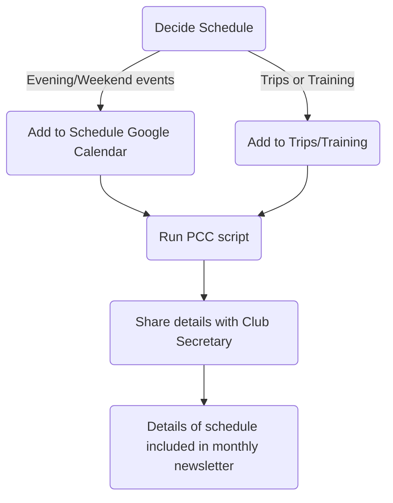

# Events Calendar

The Meets Secretary organises a schedule of evening and weekend meets and helps coordinate trips away.

For the convenience of members these are added to a Google Calendar and shared so that people have a simple way of
looking up on their mobile devices where they are going.

This page details how to administer and add new events to the calendar. An overview of the steps required is shown in
the flowchart below.

## Ownership

For this to work someone needs a Google account under which to store the data, calendars and run scripts. For the time
being these reside with Neil Shephard who has a disposable Gmail account to do things associated with climbing. In time
it may make sense to transfer ownership and responsibility of these tasks to the club Secretary and the associated account.

## Google Sheets

In order to work the schedule needs to be saved as a [Google Sheets][google_sheets] with columns in a specific
order. The current spreadsheet to which events can be added to [Peak Climbing Club Schedule][pcc_schedule]. There are
two worksheets `schedule` and `trips`. The former is for evening and weekend days out, the later for weekend meets away
and longer trips.

### Schedule

The columns (aka "Schema") of this sheet is as follows

| Column           | Type    | Description                                                              |
| :--------------- | ------- | ------------------------------------------------------------------------ |
| `CalendarID`     | str     | Calendar to which the event should be added.                             |
| `Date`           | date    | Date in [ISO8601][iso8601] `YYYY-MM-DD` format.                          |
| `Start Time`     | time    | Time in `HH:MM` format.                                                  |
| `End Time`       | time    | Time in `HH:MM` format.                                                  |
| `Primary Venue`  | str     | Venue for the event, typically a crag or indoor wall.                    |
| `Backup`         | str     | Backup venue.                                                            |
| `Pub`            | str     | Pub for post-climbing refreshments                                       |
| `Notes`          | str     | Notes, typically around parking at the proposed venue.                   |
| `EventStart`     | formula | `Date` + `Start Time` combined to a single field (used in calendar)      |
| `EventEnd`       | formula | `Date` + `End Time` combined to a single field (used in calendar)        |
| `EventName`      | formula | `Primary Venue` + `Backup` combined to a single field (used in calendar) |
| `EventDetails`   | formula | `Pub` + `Notes` combined to a single field (used in calendar)            |
| `Civil Twilight` | time    | Sunset time, not currently used.                                         |

### Trips

The columns (aka "Schema") of this sheet is as follows

| Column         | Type | Description                                                   |
| -------------- | ---- | ------------------------------------------------------------- |
| `EventStart`   | date | Date in [ISO8610][iso8601] format.                            |
| `EventEnd`     | date | Date in [ISO8610][iso8601] format.                            |
| `EventName`    | str  | Short description of event, either training or venue of trip. |
| `EventDetails` | str  | Typically the co-ordinator of the event.                      |

## Google Calendar

[Google Calendar][google_calendar] is used to provide a publicly available calendar which others can subscribe to if
they have a Google account or other Calendar service which allows subscriptions, or a snapshot can be downloaded in
[iCal][ical] and imported to their calendar.

The two calendars are

- [**PCC Local Meets**][pcc_calendar_local] - for Tuesday/Thursday and venues at the weekend local to Sheffield.
- [**PCC - Trips & Training**][pcc_calendar_trips] - for weekends away, training events and longer jaunts away climbing.

A third calendar exists **PCC - Test** which was used when developing the workflow and code but is essentially redundant
now.

Club members can add these calendars to their own using the [iCal][ical] links under the [Using the
calendar](#using-the-calendar) section.

## Google Scripts

[Google Scripts][google_scripts] is the glue the sticks the information on meets stored in the [Peak Climbing Club
Schedule][pcc_schedule] Google Sheet into the Peak Climbing Club Calendars (both [Local Meets][pcc_calendar_local] and
[Trips][pcc_calendar_trips]). It is similar in structure to [JavaScript][js]. As with both the sheets and calendar this
has to reside under an individuals Google account but a copy of the script is version controlled as part of this
repository (see [PCC Calendar Script][gs_pcc_script]).

The script pulls out specific columns, based on the argument `event_start_col` provided to the `schedule()` function for
a fixed number of rows, the code is fairly lazy and expects this to be the date on which events starts which is
ultimately stored in the `begin` variable and for it to be followed columns in a specific order, the next being
`EventEnd` (stored in `end`), then `EventName` (stored in `venue`) and finally `EventDetails` (stored in `description`).

Existing events from `2025-01-01` through to `2030-01-01` are removed, this avoids duplicate entries occurring when the
script is re-run (a lazy option rather than checking to see if an event already exists which does have some drawbacks).

The list of events is then looped over, pulling out the necessary information and using the `CalendarApp.createEvent()`
method to create the event in the correct calendar with the required details.

It should be noted the script is _not_ very well written or structured. JavaScript is not something the author is
particularly familiar with and therefore there is considerable scope for improvement.

### Updating Calendar

When ready to run the script use the **Run** button on the Google Scripts page. You can view the log messages in the
console and all being well it should sit there and churn away. It takes a while as a short pause between each submission
is required to avoid hitting the API rate limits.

## Limitations

At the moment existing events are left in the spreadsheet and the value of the number of events to pull out, which is
currently `400`, can be increased if required. Ideally this limit should be very high and the code should check to see
if an event exists and _not_ add it if it does, but as mentioned this is a messy hack. There are two options if the
number of rows in the Spreadsheets exceeds `400`

1. Remove old events.
2. Increase the threshold in the script.

## Using the Calendar

Members who wish to subscribe to the calendar on their own account, whether that is Google or others such as
[Proton][proton] (a privacy respecting email/calendar/password manager service that has a free tier available) can do so
by importing the [iCal][ical] links to their account. The links are...

- [PCC Local Meets iCal][pcc_calendar_ical_local]
- [PCC Trips & Training iCal][pcc_calendar_ical_trips]

These files can be saved (_Right Click > Save Link_) and the imported to a calendar. There are instructions for
importing to [Google calendars][google_desktop_impport] and [Proton calendars][proton_desktop_import]. On mobile
downloading the above links should allow you to import them to your calendar.

After importing users may want to disable notifications for the imported calendar. How to do this will depend on the
calendar system used.

[google_calendar]: https://support.google.com/calendar/?hl=en#topic=10509740
[google_desktop_impport]: https://support.google.com/calendar/answer/37118?hl=en&co=GENIE.Platform%3DDesktop
[google_scripts]: https://developers.google.com/apps-script/support
[google_sheets]: https://support.google.com/a/users/answer/9282959?hl=en
[gs_pcc_script]: https://codeberg.org/slackline/pcc-admin/src/branch/main/scripts/populate_calendar.js
[ical]: https://en.wikipedia.org/wiki/ICalendar
[iso8601]: https://en.wikipedia.org/wiki/ISO_8601
[js]: https://en.wikipedia.org/wiki/JavaScript
[pcc_calendar_local]: https://calendar.google.com/calendar/embed?src=3412ff22d718172b3eccf2e345bb09be43f8c46771e10dc29f9f8d085fa2a053%40group.calendar.google.com&ctz=Europe%2FLondon
[pcc_calendar_trips]: https://calendar.google.com/calendar/embed?src=2f51a5bcf421937822c08f6fcbbde00ab453f958e1df1fdc277cac9256235034%40group.calendar.google.com&ctz=Europe%2FLondon
[pcc_schedule]: https://docs.google.com/spreadsheets/d/14bFheHdIk8RrWQsDYKMBgmciu9zmjT80zzLd8skBSug/
[pcc_calendar_ical_local]: https://calendar.google.com/calendar/ical/3412ff22d718172b3eccf2e345bb09be43f8c46771e10dc29f9f8d085fa2a053%40group.calendar.google.com/public/basic.ics
[pcc_calendar_ical_trips]: https://calendar.google.com/calendar/ical/2f51a5bcf421937822c08f6fcbbde00ab453f958e1df1fdc277cac9256235034%40group.calendar.google.com/public/basic.ics
[proton]: https://proton.me/
[proton_desktop_import]: https://proton.me/support/how-to-import-calendar-to-proton-calendar
